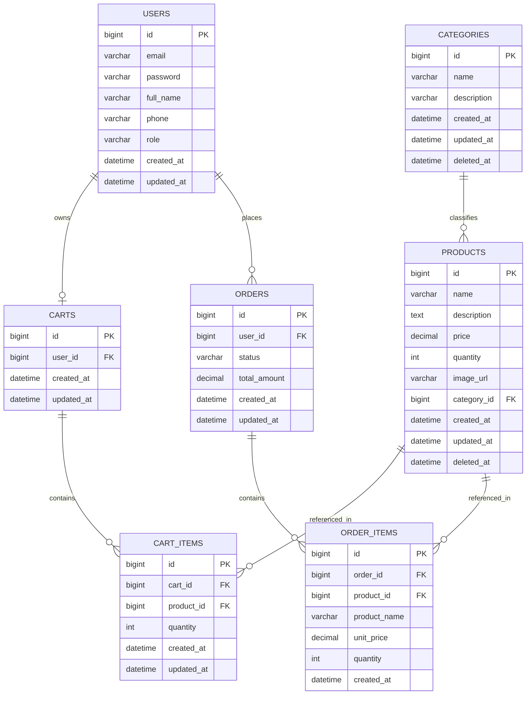

# Mini E-Commerce Backend — Technical Design Document

**Stack:** Java 21, Spring Boot 3, Spring Data JPA, Spring Security (JWT), MySQL 8, Maven, Lombok, Docker Compose

---

## 1. Kiến trúc tổng quan

### 1.1. Luồng request

```
Client (Postman / FE)
      │  HTTP Request + Bearer Token
      ▼
JwtAuthenticationFilter  ──► xác thực token, set SecurityContext
      ▼
SecurityFilterChain  ──► kiểm tra quyền theo path/role
      ▼
Controller  ──► nhận DTO, validate (@Valid), gọi Service
      ▼
Service  ──► business logic, transaction (@Transactional), gọi Repository
      ▼
Repository (Spring Data JPA)  ──► sinh SQL, thao tác Entity
      ▼
MySQL Database
```

### 1.2. Vai trò từng layer

**Controller** chỉ chịu trách nhiệm nhận HTTP request, validate input ở mức cú pháp (Bean Validation), map sang DTO, gọi Service tương ứng và trả về ResponseEntity với status code phù hợp. Controller không chứa business logic, không truy cập Repository trực tiếp.

**Service** là nơi chứa toàn bộ business logic: kiểm tra tồn kho, tính tổng tiền order, kiểm tra luồng chuyển trạng thái order, quy đổi Entity ↔ DTO. Service là nơi đặt boundary transaction (`@Transactional`) vì một use case có thể chạm vào nhiều Repository (ví dụ tạo Order: đọc Cart, trừ stock Product, ghi Order, xóa Cart — tất cả phải atomic).

**Repository** chỉ chịu trách nhiệm truy xuất dữ liệu (Spring Data JPA interface), không chứa business logic. Các query phức tạp (filter, soft-delete) được khai báo bằng method name hoặc `@Query`.

**Entity** map 1-1 với table trong DB, không chứa logic nghiệp vụ phức tạp ngoài các helper nhỏ.

**DTO** tách biệt hoàn toàn với Entity để: (1) không lộ field nhạy cảm (password hash) ra response, (2) tránh lỗi lazy-loading khi serialize JSON, (3) cho phép API contract ổn định dù Entity thay đổi.

### 1.3. Lý do tách layer

Tách layer giúp: test được Service độc lập (mock Repository) mà không cần khởi động web context; thay đổi DB (MySQL → Postgres) không ảnh hưởng Controller; thay đổi API response format không ảnh hưởng business logic; nhiều người có thể làm việc song song trên các layer khác nhau mà ít conflict.

---

## 2. Database Schema

Tất cả bảng dùng `id BIGINT AUTO_INCREMENT PRIMARY KEY`. Timestamp dùng `DATETIME`, tự set qua `@CreationTimestamp` / `@UpdateTimestamp` (Hibernate) — không cần default ở DB level.

### 2.1. `users`

| Column | Type | Constraint |
|---|---|---|
| id | BIGINT | PK, AUTO_INCREMENT |
| email | VARCHAR(255) | NOT NULL, UNIQUE |
| password | VARCHAR(255) | NOT NULL (BCrypt hash) |
| full_name | VARCHAR(255) | NOT NULL |
| phone | VARCHAR(20) | NULL |
| role | ENUM('USER','ADMIN') | NOT NULL, DEFAULT 'USER' |
| created_at | DATETIME | NOT NULL |
| updated_at | DATETIME | NOT NULL |

### 2.2. `categories`

| Column | Type | Constraint |
|---|---|---|
| id | BIGINT | PK, AUTO_INCREMENT |
| name | VARCHAR(100) | NOT NULL, UNIQUE |
| description | VARCHAR(500) | NULL |
| created_at | DATETIME | NOT NULL |
| updated_at | DATETIME | NOT NULL |
| deleted_at | DATETIME | NULL (soft delete — NULL = còn active) |

### 2.3. `products`

| Column | Type | Constraint |
|---|---|---|
| id | BIGINT | PK, AUTO_INCREMENT |
| name | VARCHAR(255) | NOT NULL |
| description | TEXT | NULL |
| price | DECIMAL(12,2) | NOT NULL, CHECK (price >= 0) |
| quantity | INT | NOT NULL, DEFAULT 0, CHECK (quantity >= 0) |
| image_url | VARCHAR(500) | NULL (URL ảnh đại diện sản phẩm, không lưu file) |
| category_id | BIGINT | FK → categories.id, NOT NULL |
| created_at | DATETIME | NOT NULL |
| updated_at | DATETIME | NOT NULL |
| deleted_at | DATETIME | NULL (soft delete) |

Quan hệ: `Category (1) ── (N) Product`.

### 2.4. `carts`

| Column | Type | Constraint |
|---|---|---|
| id | BIGINT | PK, AUTO_INCREMENT |
| user_id | BIGINT | FK → users.id, NOT NULL, UNIQUE (1 user = 1 cart) |
| created_at | DATETIME | NOT NULL |
| updated_at | DATETIME | NOT NULL |

Quan hệ: `User (1) ── (1) Cart`.

### 2.5. `cart_items`

| Column | Type | Constraint |
|---|---|---|
| id | BIGINT | PK, AUTO_INCREMENT |
| cart_id | BIGINT | FK → carts.id, NOT NULL |
| product_id | BIGINT | FK → products.id, NOT NULL |
| quantity | INT | NOT NULL, CHECK (quantity > 0) |
| created_at | DATETIME | NOT NULL |
| updated_at | DATETIME | NOT NULL |

Ràng buộc bổ sung: `UNIQUE (cart_id, product_id)` — một sản phẩm chỉ xuất hiện 1 dòng trong cart, thêm lần 2 sẽ cộng dồn `quantity`. Hard delete khi remove item hoặc khi checkout xong (xóa hết item + có thể xóa luôn cart hoặc giữ cart rỗng — thiết kế ở đây là xóa hết `cart_items` của cart, giữ lại `cart` rỗng để không phải tạo lại).

Quan hệ: `Cart (1) ── (N) CartItem`, `Product (1) ── (N) CartItem`.

### 2.6. `orders`

| Column | Type | Constraint |
|---|---|---|
| id | BIGINT | PK, AUTO_INCREMENT |
| user_id | BIGINT | FK → users.id, NOT NULL |
| status | ENUM('PENDING','CONFIRMED','SHIPPING','DELIVERED','CANCELLED') | NOT NULL, DEFAULT 'PENDING' |
| total_amount | DECIMAL(12,2) | NOT NULL |
| created_at | DATETIME | NOT NULL |
| updated_at | DATETIME | NOT NULL |

Quan hệ: `User (1) ── (N) Order`.

### 2.7. `order_items`

| Column | Type | Constraint |
|---|---|---|
| id | BIGINT | PK, AUTO_INCREMENT |
| order_id | BIGINT | FK → orders.id, NOT NULL |
| product_id | BIGINT | FK → products.id, NOT NULL |
| product_name | VARCHAR(255) | NOT NULL (snapshot tên SP tại thời điểm mua) |
| unit_price | DECIMAL(12,2) | NOT NULL (snapshot giá tại thời điểm mua) |
| quantity | INT | NOT NULL, CHECK (quantity > 0) |
| created_at | DATETIME | NOT NULL |

Lý do snapshot `product_name`/`unit_price`: nếu Admin sửa giá hoặc xóa Product sau này, lịch sử Order không bị ảnh hưởng.

Quan hệ: `Order (1) ── (N) OrderItem`, `Product (1) ── (N) OrderItem`.

---

## 3. ERD (Mermaid)



---

## 4. Folder Structure

```
ecommerce-backend/
├── src/
│   ├── main/
│   │   ├── java/com/example/ecommerce/
│   │   │   ├── EcommerceApplication.java       # Entry point Spring Boot
│   │   │   │
│   │   │   ├── config/                         # Cấu hình framework-level
│   │   │   │   ├── SecurityConfig.java          # SecurityFilterChain, PasswordEncoder, CORS
│   │   │   │   └── DataSeeder.java              # CommandLineRunner: seed admin account
│   │   │   │
│   │   │   ├── controller/                      # REST endpoints, không chứa logic
│   │   │   │   ├── AuthController.java
│   │   │   │   ├── CategoryController.java
│   │   │   │   ├── ProductController.java
│   │   │   │   ├── CartController.java
│   │   │   │   └── OrderController.java
│   │   │   │
│   │   │   ├── service/                         # Business logic interfaces
│   │   │   │   ├── AuthService.java
│   │   │   │   ├── CategoryService.java
│   │   │   │   ├── ProductService.java
│   │   │   │   ├── CartService.java
│   │   │   │   ├── OrderService.java
│   │   │   │   └── impl/                        # Implementation + @Transactional
│   │   │   │       ├── AuthServiceImpl.java
│   │   │   │       ├── CategoryServiceImpl.java
│   │   │   │       ├── ProductServiceImpl.java
│   │   │   │       ├── CartServiceImpl.java
│   │   │   │       └── OrderServiceImpl.java
│   │   │   │
│   │   │   ├── repository/                       # Spring Data JPA interfaces
│   │   │   │   ├── UserRepository.java
│   │   │   │   ├── CategoryRepository.java
│   │   │   │   ├── ProductRepository.java
│   │   │   │   ├── CartRepository.java
│   │   │   │   ├── CartItemRepository.java
│   │   │   │   ├── OrderRepository.java
│   │   │   │   └── OrderItemRepository.java
│   │   │   │
│   │   │   ├── entity/                           # JPA entities = mapping table
│   │   │   │   ├── User.java
│   │   │   │   ├── Category.java
│   │   │   │   ├── Product.java
│   │   │   │   ├── Cart.java
│   │   │   │   ├── CartItem.java
│   │   │   │   ├── Order.java
│   │   │   │   ├── OrderItem.java
│   │   │   │   └── enums/
│   │   │   │       ├── Role.java
│   │   │   │       └── OrderStatus.java
│   │   │   │
│   │   │   ├── dto/                              # Request/Response objects
│   │   │   │   ├── auth/
│   │   │   │   │   ├── RegisterRequest.java
│   │   │   │   │   ├── LoginRequest.java
│   │   │   │   │   ├── AuthResponse.java
│   │   │   │   │   └── UserResponse.java
│   │   │   │   ├── category/
│   │   │   │   │   ├── CategoryRequest.java
│   │   │   │   │   └── CategoryResponse.java
│   │   │   │   ├── product/
│   │   │   │   │   ├── ProductRequest.java
│   │   │   │   │   └── ProductResponse.java
│   │   │   │   ├── cart/
│   │   │   │   │   ├── CartItemRequest.java
│   │   │   │   │   ├── UpdateCartItemRequest.java
│   │   │   │   │   ├── CartItemResponse.java
│   │   │   │   │   └── CartResponse.java
│   │   │   │   └── order/
│   │   │   │       ├── OrderStatusUpdateRequest.java
│   │   │   │       ├── OrderItemResponse.java
│   │   │   │       └── OrderResponse.java
│   │   │   │
│   │   │   ├── security/                         # JWT machinery
│   │   │   │   ├── JwtTokenProvider.java          # generate/validate/parse token
│   │   │   │   ├── JwtAuthenticationFilter.java   # OncePerRequestFilter
│   │   │   │   └── CustomUserDetailsService.java  # load user cho Spring Security
│   │   │   │
│   │   │   ├── exception/                        # Custom exceptions + handler
│   │   │   │   ├── ResourceNotFoundException.java
│   │   │   │   ├── BadRequestException.java
│   │   │   │   ├── UnauthorizedException.java
│   │   │   │   ├── InsufficientStockException.java
│   │   │   │   ├── ErrorResponse.java
│   │   │   │   └── GlobalExceptionHandler.java
│   │   │   │
│   │   │   └── common/                           # Shared utility classes
│   │   │       └── PageResponse.java              # wrapper chuẩn hoá response phân trang
│   │   │
│   │   └── resources/
│   │       └── application.yml
│   │
│   └── test/
│       └── java/com/example/ecommerce/
│           ├── service/                          # unit test (Mockito)
│           └── controller/                        # integration test (@SpringBootTest)
│
├── Dockerfile
├── docker-compose.yml
├── .env.example
├── pom.xml
└── README.md
```

---

## 5. API Contract

Quy ước chung: tất cả endpoint trả list đều hỗ trợ `?page=0&size=10&sort=field,direction`. Response phân trang dùng format:

```json
{
  "content": [ ... ],
  "page": 0,
  "size": 10,
  "totalElements": 42,
  "totalPages": 5,
  "last": false
}
```

Error response format (chi tiết ở mục 8):

```json
{
  "timestamp": "2026-06-16T10:00:00",
  "status": 404,
  "error": "Not Found",
  "message": "Product not found with id: 99",
  "path": "/api/products/99"
}
```

### 5.1. Module Auth

**POST /api/auth/register** — Auth: `PUBLIC`

Request:
```json
{ "email": "user@example.com", "password": "secret123", "fullName": "Nguyen Van A", "phone": "0901234567" }
```
Response (201):
```json
{ "id": 1, "email": "user@example.com", "fullName": "Nguyen Van A", "role": "USER" }
```
Status: `201 Created` thành công · `400 Bad Request` lỗi validate · `409 Conflict` email đã tồn tại.

**POST /api/auth/login** — Auth: `PUBLIC`

Request:
```json
{ "email": "user@example.com", "password": "secret123" }
```
Response (200):
```json
{
  "token": "eyJhbGciOiJIUzI1NiJ9...",
  "tokenType": "Bearer",
  "expiresIn": 86400000,
  "user": { "id": 1, "email": "user@example.com", "fullName": "Nguyen Van A", "role": "USER" }
}
```
Status: `200 OK` · `400 Bad Request` lỗi validate · `401 Unauthorized` sai email/password.

### 5.2. Module Category

**GET /api/categories** — Auth: `PUBLIC` — query: `page, size, sort`
Response (200): `PageResponse<CategoryResponse>`, mỗi item:
```json
{ "id": 1, "name": "Electronics", "description": "Thiết bị điện tử" }
```
Status: `200 OK`.

**GET /api/categories/{id}** — Auth: `PUBLIC`
Status: `200 OK` · `404 Not Found` (không tồn tại hoặc đã soft-delete).

**POST /api/categories** — Auth: `ADMIN`
Request:
```json
{ "name": "Electronics", "description": "Thiết bị điện tử" }
```
Status: `201 Created` · `400 Bad Request` · `401 Unauthorized` (chưa login) · `403 Forbidden` (login nhưng không phải ADMIN) · `409 Conflict` (trùng tên).

**PUT /api/categories/{id}** — Auth: `ADMIN`
Request body giống POST. Status: `200 OK` · `400` · `401` · `403` · `404` · `409`.

**DELETE /api/categories/{id}** — Auth: `ADMIN` (soft delete — set `deleted_at`)
Status: `204 No Content` · `401` · `403` · `404`.

### 5.3. Module Product

**GET /api/products** — Auth: `PUBLIC` — query: `page, size, sort, categoryId, keyword`
Response item:
```json
{
  "id": 10, "name": "iPhone 17", "description": "...",
  "price": 999.00, "quantity": 50,
  "imageUrl": "https://cdn.example.com/products/iphone-17.jpg",
  "category": { "id": 1, "name": "Electronics" }
}
```
Status: `200 OK`.

**GET /api/products/{id}** — Auth: `PUBLIC`
Status: `200 OK` · `404 Not Found`.

**POST /api/products** — Auth: `ADMIN`
Request:
```json
{
  "name": "iPhone 17", "description": "...", "price": 999.00, "quantity": 50,
  "imageUrl": "https://cdn.example.com/products/iphone-17.jpg",
  "categoryId": 1
}
```
`imageUrl` là optional — nếu có thì phải bắt đầu bằng `http://` hoặc `https://` (chỉ lưu URL, không upload file). Status: `201 Created` · `400 Bad Request` · `401` · `403` · `404` (categoryId không tồn tại).

**PUT /api/products/{id}** — Auth: `ADMIN` — body giống POST.
Status: `200 OK` · `400` · `401` · `403` · `404`.

**DELETE /api/products/{id}** — Auth: `ADMIN` (soft delete)
Status: `204 No Content` · `401` · `403` · `404`.

### 5.4. Module Cart

Toàn bộ module yêu cầu Auth: `USER` (mỗi user chỉ thấy/sửa cart của chính mình; cart tự tạo lúc đăng ký hoặc lazy-create lúc gọi GET lần đầu).

**GET /api/cart**
Response (200):
```json
{
  "id": 3,
  "items": [
    { "id": 7, "productId": 10, "productName": "iPhone 17", "unitPrice": 999.00, "quantity": 2, "subtotal": 1998.00 }
  ],
  "totalAmount": 1998.00
}
```
Status: `200 OK` · `401 Unauthorized`.

**POST /api/cart/items** — thêm sản phẩm vào cart (nếu đã có thì cộng dồn quantity)
Request:
```json
{ "productId": 10, "quantity": 2 }
```
Status: `200 OK` (trả CartResponse mới) · `400 Bad Request` (quantity <= 0) · `401` · `404` (product không tồn tại) · `409 Conflict` (vượt tồn kho — `InsufficientStockException`).

**PUT /api/cart/items/{itemId}** — cập nhật quantity của 1 item
Request:
```json
{ "quantity": 5 }
```
Status: `200 OK` · `400` · `401` · `403` (item không thuộc cart của user hiện tại) · `404` · `409` (vượt tồn kho).

**DELETE /api/cart/items/{itemId}** — hard delete item khỏi cart
Status: `204 No Content` · `401` · `403` · `404`.

### 5.5. Module Order

**POST /api/orders** — Auth: `USER` — tạo order từ cart hiện tại của user (body rỗng)

Logic: kiểm tra cart không rỗng → với mỗi cart item kiểm tra `product.quantity >= cartItem.quantity` → nếu thiếu bất kỳ sản phẩm nào thì rollback toàn bộ và trả lỗi → nếu đủ: trừ `quantity` từng Product, tạo `Order` + `OrderItem` (snapshot giá/tên), xóa toàn bộ `cart_items` của cart.

Response (201):
```json
{
  "id": 55, "status": "PENDING", "totalAmount": 1998.00,
  "items": [
    { "productId": 10, "productName": "iPhone 17", "unitPrice": 999.00, "quantity": 2, "subtotal": 1998.00 }
  ],
  "createdAt": "2026-06-16T10:00:00"
}
```
Status: `201 Created` · `400 Bad Request` (cart rỗng) · `401` · `409 Conflict` (hết hàng — `InsufficientStockException`).

**GET /api/orders** — Auth: `USER` xem order của chính mình · `ADMIN` xem tất cả — query: `page, size, status`
Status: `200 OK` · `401`.

**GET /api/orders/{id}** — Auth: `USER` (chỉ order của mình) / `ADMIN` (bất kỳ order)
Status: `200 OK` · `401` · `403` (USER xem order của người khác) · `404`.

**PATCH /api/orders/{id}/status** — Auth: `ADMIN` duy nhất

Request:
```json
{ "status": "CONFIRMED" }
```
Luồng hợp lệ: `PENDING → CONFIRMED → SHIPPING → DELIVERED`, hoặc từ `PENDING`/`CONFIRMED` → `CANCELLED`. Mọi transition khác bị từ chối.

Status: `200 OK` · `400 Bad Request` (transition không hợp lệ, validate trong Service) · `401` · `403` · `404`.

---

## 6. Security Design

### 6.1. JWT flow

1. Client gọi `POST /api/auth/login` với email/password.
2. `AuthenticationManager` (Spring Security) xác thực qua `CustomUserDetailsService` + `PasswordEncoder` (BCrypt).
3. Nếu hợp lệ, `JwtTokenProvider` sinh token chứa claim `sub=email`, `role=ROLE_USER|ROLE_ADMIN`, `exp`, ký bằng HMAC-SHA256 với secret từ `JWT_SECRET`.
4. Client lưu token, gửi kèm mọi request tiếp theo qua header `Authorization: Bearer <token>`.
5. `JwtAuthenticationFilter` (extends `OncePerRequestFilter`, đặt trước `UsernamePasswordAuthenticationFilter`) đọc header, validate token (chữ ký + hết hạn), parse claims, build `UsernamePasswordAuthenticationToken` rồi set vào `SecurityContextHolder`.
6. Request đi tiếp tới Controller với `SecurityContext` đã có authentication; nếu token thiếu/sai/hết hạn → request vẫn đi qua filter (không reject ở filter) nhưng `SecurityContext` trống → các path yêu cầu auth sẽ bị `AuthenticationEntryPoint` chặn và trả `401`.
7. Không dùng refresh token theo yêu cầu — token hết hạn thì client phải login lại.

### 6.2. Phân quyền USER vs ADMIN

`SecurityConfig` khai báo `SecurityFilterChain` dạng lambda DSL (Spring Security 6):

- `permitAll()`: `POST /api/auth/**`, `GET /api/categories/**`, `GET /api/products/**`.
- `hasRole("ADMIN")`: `POST|PUT|DELETE /api/categories/**`, `POST|PUT|DELETE /api/products/**`, `PATCH /api/orders/*/status`.
- `hasAnyRole("USER","ADMIN")`: `/api/cart/**`, `POST|GET /api/orders/**` (riêng filter dữ liệu theo ownership được xử lý trong Service, không phải ở filter chain, vì Spring Security path-matching không biết ai là "chủ" của order).
- Mọi path khác mặc định `authenticated()`.
- Session policy: `STATELESS` (không dùng `HttpSession`), tắt CSRF (vì là REST API dùng JWT, không dùng cookie).
- `@EnableMethodSecurity` cho phép dùng thêm `@PreAuthorize("hasRole('ADMIN')")` trực tiếp trên method Controller nếu cần kiểm soát chi tiết hơn path-matcher.
- Ownership check (USER chỉ xem order của mình) nằm trong `OrderServiceImpl`: so sánh `order.getUser().getId()` với id của user đang đăng nhập (lấy từ `SecurityContextHolder`), nếu không khớp và role không phải ADMIN → throw exception map sang `403`.

### 6.3. Password & seed admin

Password hash bằng `BCryptPasswordEncoder` (strength mặc định 10). `DataSeeder` (`CommandLineRunner`) kiểm tra nếu chưa có user role `ADMIN` trong DB thì tạo 1 admin với email/password lấy từ biến môi trường `ADMIN_EMAIL` / `ADMIN_PASSWORD` (có default trong `application.yml`).

---

## 7. Validation Rules

**RegisterRequest:** `email` → `@NotBlank @Email`; `password` → `@NotBlank @Size(min=6, max=100)`; `fullName` → `@NotBlank @Size(max=255)`; `phone` → `@Pattern(regexp="^[0-9]{9,11}$")` (optional, không bắt buộc).

**LoginRequest:** `email` → `@NotBlank @Email`; `password` → `@NotBlank`.

**CategoryRequest:** `name` → `@NotBlank @Size(max=100)`; `description` → `@Size(max=500)`.

**ProductRequest:** `name` → `@NotBlank @Size(max=255)`; `description` → `@Size(max=2000)`; `price` → `@NotNull @DecimalMin(value="0.0", inclusive=false)`; `quantity` → `@NotNull @Min(0)`; `imageUrl` → optional, `@Size(max=500)` + `@Pattern` bắt buộc bắt đầu bằng `http://` hoặc `https://` nếu có giá trị; `categoryId` → `@NotNull`.

**CartItemRequest:** `productId` → `@NotNull`; `quantity` → `@NotNull @Min(1)`.

**UpdateCartItemRequest:** `quantity` → `@NotNull @Min(1)`.

**OrderStatusUpdateRequest:** `status` → `@NotNull` (enum `OrderStatus`, Jackson tự reject giá trị string không khớp enum → trả `400` qua `HttpMessageNotReadableException` handler).

Tất cả Controller method nhận body đều có `@Valid @RequestBody`. Lỗi validate được `GlobalExceptionHandler` bắt qua `MethodArgumentNotValidException` và trả về danh sách lỗi theo field.

---

## 8. Exception Handling

### 8.1. Custom exceptions

| Exception | HTTP Status | Trường hợp dùng |
|---|---|---|
| `ResourceNotFoundException` | 404 Not Found | Không tìm thấy entity theo id (User/Category/Product/Order/CartItem) |
| `BadRequestException` | 400 Bad Request | Input hợp lệ về cú pháp nhưng vi phạm business rule (cart rỗng, transition trạng thái order không hợp lệ, trùng tên category) |
| `UnauthorizedException` | 401 Unauthorized | Sai credential lúc login, token không hợp lệ (ngoài các case Spring Security tự bắt) |
| `InsufficientStockException` | 409 Conflict | Số lượng đặt > tồn kho khi thêm/sửa cart item hoặc tạo order |

### 8.2. Error response format (đồng nhất toàn hệ thống)

```json
{
  "timestamp": "2026-06-16T10:00:00",
  "status": 404,
  "error": "Not Found",
  "message": "Product not found with id: 99",
  "path": "/api/products/99",
  "errors": null
}
```

Khi là lỗi validate, `errors` là danh sách field-level:
```json
"errors": [
  { "field": "price", "message": "must be greater than 0" },
  { "field": "name", "message": "must not be blank" }
]
```

### 8.3. `GlobalExceptionHandler` (thiết kế)

```java
@RestControllerAdvice
public class GlobalExceptionHandler {

    @ExceptionHandler(ResourceNotFoundException.class)
    public ResponseEntity<ErrorResponse> handleNotFound(ResourceNotFoundException ex, HttpServletRequest req) {
        return build(HttpStatus.NOT_FOUND, ex.getMessage(), req, null);
    }

    @ExceptionHandler(BadRequestException.class)
    public ResponseEntity<ErrorResponse> handleBadRequest(BadRequestException ex, HttpServletRequest req) {
        return build(HttpStatus.BAD_REQUEST, ex.getMessage(), req, null);
    }

    @ExceptionHandler(UnauthorizedException.class)
    public ResponseEntity<ErrorResponse> handleUnauthorized(UnauthorizedException ex, HttpServletRequest req) {
        return build(HttpStatus.UNAUTHORIZED, ex.getMessage(), req, null);
    }

    @ExceptionHandler(InsufficientStockException.class)
    public ResponseEntity<ErrorResponse> handleInsufficientStock(InsufficientStockException ex, HttpServletRequest req) {
        return build(HttpStatus.CONFLICT, ex.getMessage(), req, null);
    }

    @ExceptionHandler(AccessDeniedException.class)
    public ResponseEntity<ErrorResponse> handleAccessDenied(AccessDeniedException ex, HttpServletRequest req) {
        return build(HttpStatus.FORBIDDEN, "Access is denied", req, null);
    }

    @ExceptionHandler(BadCredentialsException.class)
    public ResponseEntity<ErrorResponse> handleBadCredentials(BadCredentialsException ex, HttpServletRequest req) {
        return build(HttpStatus.UNAUTHORIZED, "Invalid email or password", req, null);
    }

    @ExceptionHandler(MethodArgumentNotValidException.class)
    public ResponseEntity<ErrorResponse> handleValidation(MethodArgumentNotValidException ex, HttpServletRequest req) {
        List<FieldErrorDetail> errors = ex.getBindingResult().getFieldErrors().stream()
                .map(f -> new FieldErrorDetail(f.getField(), f.getDefaultMessage()))
                .toList();
        return build(HttpStatus.BAD_REQUEST, "Validation failed", req, errors);
    }

    @ExceptionHandler(Exception.class)
    public ResponseEntity<ErrorResponse> handleGeneric(Exception ex, HttpServletRequest req) {
        return build(HttpStatus.INTERNAL_SERVER_ERROR, "An unexpected error occurred", req, null);
    }

    private ResponseEntity<ErrorResponse> build(HttpStatus status, String message,
                                                  HttpServletRequest req, List<FieldErrorDetail> errors) {
        ErrorResponse body = new ErrorResponse(
                LocalDateTime.now(), status.value(), status.getReasonPhrase(),
                message, req.getRequestURI(), errors);
        return ResponseEntity.status(status).body(body);
    }
}
```

---

## 9. Docker Setup

Các file dưới đây đã được tạo sẵn (xem các file kèm theo: `Dockerfile`, `docker-compose.yml`, `application.yml`, `.env.example`), chỉ cần copy vào root project và `cp .env.example .env` trước khi chạy `docker compose up --build`.

### 9.1. Dockerfile (multi-stage)

```dockerfile
# ---------- Stage 1: Build ----------
FROM maven:3.9-eclipse-temurin-21 AS build
WORKDIR /app
COPY pom.xml .
RUN mvn -B dependency:go-offline
COPY src ./src
RUN mvn -B clean package -DskipTests

# ---------- Stage 2: Run ----------
FROM eclipse-temurin:21-jre-alpine
WORKDIR /app
COPY --from=build /app/target/*.jar app.jar
EXPOSE 8080
ENTRYPOINT ["java", "-jar", "app.jar"]
```

### 9.2. docker-compose.yml

```yaml
services:
  app:
    build:
      context: .
      dockerfile: Dockerfile
    container_name: ecommerce-app
    restart: on-failure
    depends_on:
      db:
        condition: service_healthy
    ports:
      - "${SERVER_PORT:-8080}:8080"
    environment:
      SERVER_PORT: ${SERVER_PORT:-8080}
      DB_HOST: db
      DB_PORT: 3306
      DB_NAME: ${DB_NAME:-ecommerce_db}
      DB_USERNAME: ${DB_USERNAME:-ecommerce_user}
      DB_PASSWORD: ${DB_PASSWORD:-ecommerce_pass}
      JWT_SECRET: ${JWT_SECRET}
      JWT_EXPIRATION: ${JWT_EXPIRATION:-86400000}
      ADMIN_EMAIL: ${ADMIN_EMAIL:-admin@ecommerce.com}
      ADMIN_PASSWORD: ${ADMIN_PASSWORD:-Admin@123}
      ADMIN_FULL_NAME: ${ADMIN_FULL_NAME:-System Administrator}
    networks:
      - ecommerce-network

  db:
    image: mysql:8.0
    container_name: ecommerce-db
    restart: on-failure
    environment:
      MYSQL_ROOT_PASSWORD: ${DB_ROOT_PASSWORD:-root_pass}
      MYSQL_DATABASE: ${DB_NAME:-ecommerce_db}
      MYSQL_USER: ${DB_USERNAME:-ecommerce_user}
      MYSQL_PASSWORD: ${DB_PASSWORD:-ecommerce_pass}
    ports:
      - "3307:3306"
    volumes:
      - mysql_data:/var/lib/mysql
    healthcheck:
      test: ["CMD", "mysqladmin", "ping", "-h", "localhost", "-u", "root", "-p${DB_ROOT_PASSWORD:-root_pass}"]
      interval: 10s
      timeout: 5s
      retries: 10
      start_period: 30s
    networks:
      - ecommerce-network

volumes:
  mysql_data:

networks:
  ecommerce-network:
    driver: bridge
```

### 9.3. application.yml

```yaml
server:
  port: ${SERVER_PORT:8080}

spring:
  datasource:
    url: jdbc:mysql://${DB_HOST:localhost}:${DB_PORT:3306}/${DB_NAME:ecommerce_db}?useSSL=false&serverTimezone=UTC&allowPublicKeyRetrieval=true
    username: ${DB_USERNAME:ecommerce_user}
    password: ${DB_PASSWORD:ecommerce_pass}
    driver-class-name: com.mysql.cj.jdbc.Driver
    hikari:
      maximum-pool-size: ${DB_POOL_SIZE:10}
      minimum-idle: 2
      idle-timeout: 30000
      connection-timeout: 30000
      max-lifetime: 1800000

  jpa:
    hibernate:
      ddl-auto: update
    show-sql: true
    properties:
      hibernate:
        format_sql: true
    open-in-view: false

app:
  jwt:
    secret: ${JWT_SECRET:default_dev_secret_change_me_minimum_256_bits_long_value}
    expiration: ${JWT_EXPIRATION:86400000}
  admin:
    email: ${ADMIN_EMAIL:admin@ecommerce.com}
    password: ${ADMIN_PASSWORD:Admin@123}
    full-name: ${ADMIN_FULL_NAME:System Administrator}

logging:
  level:
    root: INFO
    com.example.ecommerce: DEBUG
```

### 9.4. .env.example

```
# Server
SERVER_PORT=8080

# Database
DB_HOST=db
DB_PORT=3306
DB_NAME=ecommerce_db
DB_USERNAME=ecommerce_user
DB_PASSWORD=ecommerce_pass
DB_ROOT_PASSWORD=root_pass
DB_POOL_SIZE=10

# JWT
JWT_SECRET=please_change_this_to_a_long_random_secret_at_least_256_bits
JWT_EXPIRATION=86400000

# Default admin account (seeded on startup if not exists)
ADMIN_EMAIL=admin@ecommerce.com
ADMIN_PASSWORD=Admin@123
ADMIN_FULL_NAME=System Administrator
```

> Lưu ý: `DB_HOST=db` chỉ đúng khi chạy qua `docker compose` (tên service đóng vai trò hostname trong network nội bộ). Khi chạy local không qua Docker, đổi thành `localhost` và map đúng port MySQL.

---

## 10. Implementation Roadmap

### Phase 1 — Project setup + Docker + Auth

Thứ tự tạo file: `pom.xml` (dependencies: `spring-boot-starter-web`, `spring-boot-starter-data-jpa`, `spring-boot-starter-security`, `spring-boot-starter-validation`, `mysql-connector-j`, `lombok`, `jjwt-api`/`jjwt-impl`/`jjwt-jackson`) → `application.yml` → `Dockerfile`, `docker-compose.yml`, `.env.example` → `entity/enums/Role.java` → `entity/User.java` → `repository/UserRepository.java` → `exception/*` (5 file exception cơ bản + `ErrorResponse` + `GlobalExceptionHandler`) → `dto/auth/*` (4 file) → `security/JwtTokenProvider.java` → `security/CustomUserDetailsService.java` → `security/JwtAuthenticationFilter.java` → `config/SecurityConfig.java` → `service/AuthService.java` + `service/impl/AuthServiceImpl.java` → `controller/AuthController.java` → `config/DataSeeder.java` → `common/PageResponse.java`.

Kiểm thử: `docker compose up --build` → DB healthy → app start không lỗi → seed admin chạy 1 lần → `POST /api/auth/register`, `POST /api/auth/login` trả token hợp lệ → gọi 1 endpoint bảo vệ bất kỳ (tạm thời chưa có, có thể test bằng actuator hoặc tạo 1 endpoint `/api/me` đơn giản để xác nhận filter chain hoạt động).

### Phase 2 — Category

`entity/Category.java` → `repository/CategoryRepository.java` (method `findAllByDeletedAtIsNull(Pageable)`, `findByIdAndDeletedAtIsNull(Long)`, `existsByNameIgnoreCase(String)`) → `dto/category/CategoryRequest.java`, `CategoryResponse.java` → `service/CategoryService.java` + `impl` → `controller/CategoryController.java`.

Kiểm thử: CRUD đầy đủ qua Postman, xác nhận phân trang đúng format, xác nhận DELETE không xóa cứng (query lại DB thấy `deleted_at` có giá trị, record vẫn còn), xác nhận GET list không trả về category đã xóa.

### Phase 3 — Product

`entity/Product.java` (FK tới Category) → `repository/ProductRepository.java` (dùng `Specification` hoặc derived query cho filter `categoryId` + `keyword` + `deletedAt IS NULL`) → `dto/product/ProductRequest.java`, `ProductResponse.java` → `service/ProductService.java` + `impl` (thêm method nội bộ `decreaseStock(productId, qty)` và `checkAvailability(productId, qty)` để Phase 4/5 tái sử dụng) → `controller/ProductController.java`.

Kiểm thử: CRUD, filter theo category, search theo keyword, xác nhận tạo Product với `categoryId` không tồn tại trả `404`, xác nhận soft delete giống Category.

### Phase 4 — Cart

`entity/Cart.java`, `entity/CartItem.java` → `repository/CartRepository.java` (`findByUserId`), `repository/CartItemRepository.java` (`findByCartIdAndProductId` để xử lý cộng dồn) → `dto/cart/*` (4 file) → `service/CartService.java` + `impl` (logic: lazy-create cart nếu chưa có, add item gọi `ProductService.checkAvailability`, cộng dồn nếu item đã tồn tại) → `controller/CartController.java`.

Kiểm thử: thêm sản phẩm 2 lần → xác nhận cộng dồn quantity thành 1 dòng (không tạo 2 row), thêm vượt tồn kho → `409`, xóa item → xác nhận hard delete (query DB không còn row), update quantity vượt tồn kho → `409`.

### Phase 5 — Order

`entity/enums/OrderStatus.java` → `entity/Order.java`, `entity/OrderItem.java` → `repository/OrderRepository.java` (`findByUserId(Pageable)`, `findByStatus`), `repository/OrderItemRepository.java` → `dto/order/*` (3 file) → `service/OrderService.java` + `impl` (method `createOrderFromCart` đặt `@Transactional`: validate stock toàn bộ cart trước, nếu pass mới trừ stock + tạo order + xóa cart item; method `updateStatus` validate transition hợp lệ theo state machine; method ownership-check cho USER) → `controller/OrderController.java`.

Kiểm thử: tạo order thành công → xác nhận stock Product giảm đúng, cart rỗng sau đó; tạo order khi 1 item trong cart vượt tồn kho → toàn bộ order fail, stock các sản phẩm khác không bị trừ (test rollback transaction); ADMIN update status theo đúng/sai thứ tự → `200`/`400`; USER cố xem order của người khác → `403`.

### Phase 6 — Testing & Cleanup

Viết unit test cho Service layer bằng Mockito (mock Repository) cho các nhánh quan trọng: `OrderServiceImpl.createOrderFromCart` (case đủ hàng, case thiếu hàng, case cart rỗng), `CartServiceImpl` (case cộng dồn quantity), `AuthServiceImpl` (case email trùng, case sai password). Viết integration test cho luồng auth (`@SpringBootTest` + `TestRestTemplate` hoặc `MockMvc`) đảm bảo register → login → gọi endpoint bảo vệ hoạt động end-to-end. Rà soát lại toàn bộ message lỗi cho thân thiện, rà soát response không lộ field `password`. Viết `README.md` hướng dẫn chạy `docker compose up --build`, danh sách endpoint, tài khoản admin mẫu. Chạy full smoke test toàn bộ flow: register → login → admin tạo category/product → user thêm cart → checkout → admin cập nhật status order.

---

## 11. Frontend (Storefront + Admin)

### 11.1. Công nghệ

HTML/CSS/JS thuần — không framework, không build tool. Multi-page site (mỗi trang là 1 file `.html` riêng, không SPA/router) để đơn giản hoá việc mở trực tiếp bằng trình duyệt hoặc serve qua bất kỳ static server nào. Toàn bộ giao tiếp với backend đi qua REST API công khai (JWT trong header `Authorization`, token lưu ở `localStorage`) — frontend không có state phía server, nên cùng một API contract cũng dùng được cho client khác (mobile app, Postman...) mà không cần đổi gì ở backend.

### 11.2. Định hướng thiết kế

Vì bản chất hệ thống là quản lý tồn kho + pipeline đơn hàng, giao diện theo mô-típ "thẻ giá / sổ kho" (brand **STOCKROOM**) thay vì một template e-commerce chung: card sản phẩm có "price tag" bị cắt góc (clip-path) như thẻ giá vật lý, bảng dữ liệu theo phong cách sổ sách (hairline row, số liệu canh phải, font mono), và trang chi tiết Order có thanh tiến trình (tracker) 4 bước `PENDING → CONFIRMED → SHIPPING → DELIVERED` vì đây thực sự là một quy trình tuần tự có thật, riêng `CANCELLED` hiển thị như một nhãn rời (không nằm trong tracker tuần tự). Font: Space Grotesk (heading/brand), Inter (body/form), IBM Plex Mono (giá, số lượng, mã đơn, status).

### 11.3. Cấu trúc thư mục

```
frontend/
├── index.html                # Catalog (PUBLIC) — search, filter category, pagination
├── product.html               # Chi tiết sản phẩm (PUBLIC) — add to cart
├── login.html / register.html  # Auth (PUBLIC)
├── cart.html                    # Giỏ hàng (USER)
├── orders.html                   # Lịch sử order (USER)
├── order-detail.html              # Chi tiết order + status tracker (USER/ADMIN)
├── admin-dashboard.html            # Hub admin (ADMIN)
├── admin-categories.html            # CRUD category (ADMIN)
├── admin-products.html               # CRUD product, gồm imageUrl (ADMIN)
├── admin-orders.html                  # List toàn bộ order + cập nhật status (ADMIN)
├── css/style.css                       # Design system (token màu/typography riêng)
├── js/
│   ├── config.js      # window.API_BASE_URL
│   ├── api.js          # fetch wrapper, tự đính JWT, parse lỗi backend
│   ├── auth.js           # session (localStorage), requireLogin/requireAdmin
│   ├── nav.js              # render navbar theo trạng thái đăng nhập/role
│   ├── utils.js             # format tiền/ngày, escapeHtml, toast, pagination
│   └── page-*.js / admin-*.js  # logic riêng từng trang
├── Dockerfile                  # nginx:alpine, serve static
└── docker-entrypoint.sh          # ghi đè config.js từ env API_BASE_URL lúc container start
```

### 11.4. Tích hợp Docker

Service `frontend` build từ `frontend/Dockerfile` (nginx phục vụ static), expose qua `FRONTEND_PORT` (default `8081`), nhận biến môi trường `API_BASE_URL` — entrypoint script ghi giá trị này vào `js/config.js` lúc container khởi động. `API_BASE_URL` phải là URL mà **browser của người dùng** truy cập được (ví dụ `http://localhost:8080/api`), không phải hostname nội bộ Docker network (`app:8080`) vì JS chạy trên máy người dùng, không chạy trong container. CORS ở backend (`SecurityConfig`) đã cho phép tất cả origin nên không cần nginx reverse-proxy API.

